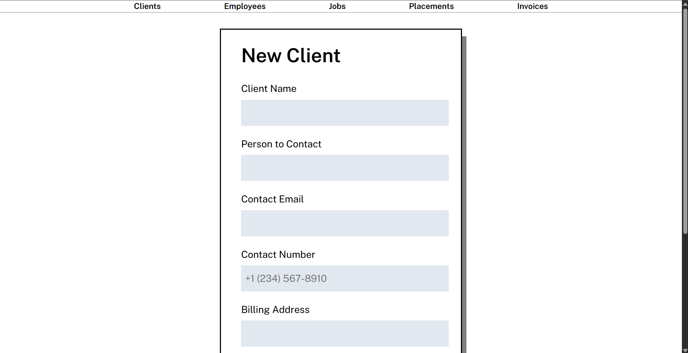
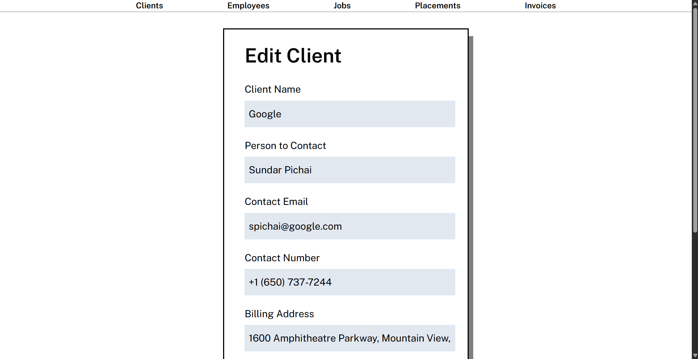
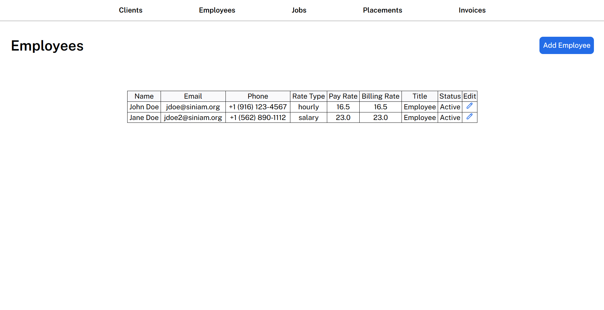
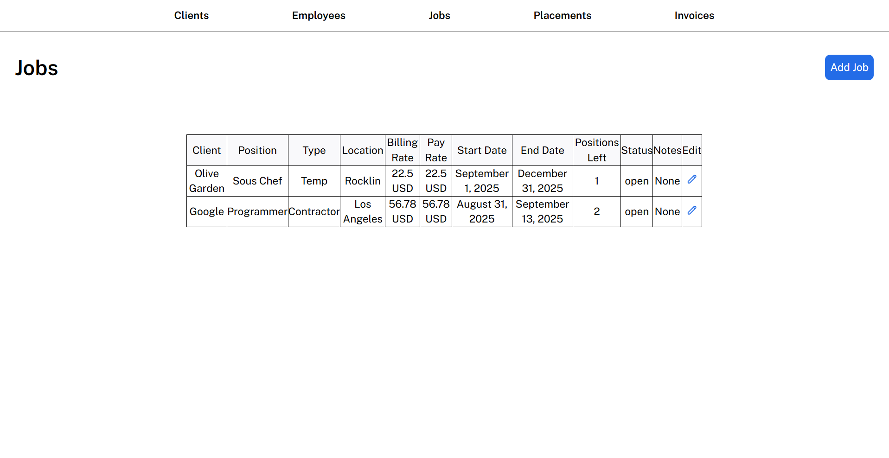
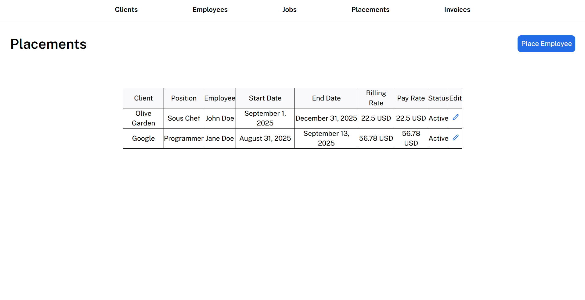
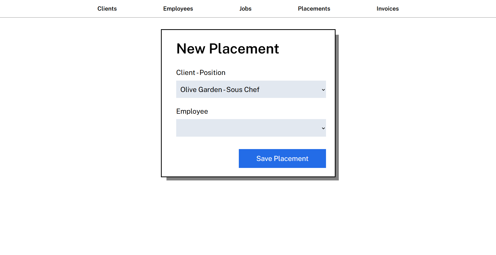
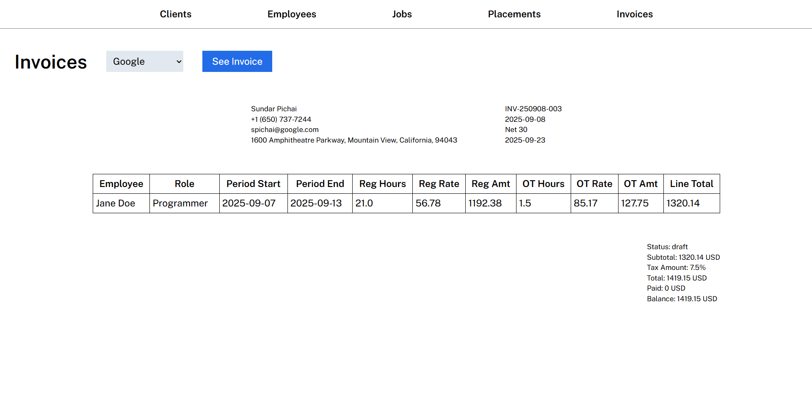

# Staffing Dashboard
This project is a demo dashboard built for a staffing and workforce management company. The application is designed to streamline day-to-day operations by providing managers with a centralized interface to manage clients, job requests, employees, and financial workflows.

The goal of this project is to demonstrate how a single, intuitive system can support the full staffing lifecycle—from client intake and employee assignment to invoicing and payment tracking—while improving visibility and operational efficiency.

This repository serves as a functional prototype and proof of concept rather than a production-ready system.

## Client Context &amp; Confidentiality
This project was developed in a client-based setting for a small staffing and workforce management firm.

To respect client confidentiality:
- Full commit history is not publicly available
- Certain modules and configurations are omitted
- All data shown is either anonymized or representative

This repository focuses on illustrating the system architecture, workflows, and my individual contributions rather than serving as a complete codebase.

## My Contributions
I primarily contributed to the backend portion of this prototype, including:
- Implementing and debugging Flask routes to support staffing workflows
- Supporting database schema usage and writing SQL queries for operational and financial data
- Integrating backend logic with HTML templates and form handling
- Debugging edge cases and refining workflows during iteration
- Participating in testing and incremental feature refinement

Because this was built in a client environment, not all development artifacts are publicly visible.

## Problem Context
Small staffing firms often manage candidates, job requests, placements, and billing using disconnected tools such as spreadsheets, email, and accounting software.

This project explores how those workflows can be centralized into a single dashboard that supports operational visibility while remaining simple enough to iterate on quickly as business needs evolve.

## Key Features
Through this platform, users can:
- Manage candidate profiles and job requests
- Track candidate-to-job placements and placement status
- View operational and basic financial information in one dashboard
- Backend-driven workflows built around real staffing processes

## Screenshots
 
 
 
 

## Architecture Overview
The application follows a lightweight full-stack architecture:
- **Frontend:** HTML/CSS templates rendered by Flask
- **Backend:** Python (Flask) with REST-style routes
- **Database:** SQLite for relational data storage

The system was designed to prioritize clarity of backend workflows and data
relationships over frontend complexity or production scalability.

## Database Design & SQL
The relational schema was designed to reflect real staffing relationships:
- Candidates can be associated with multiple job requests over time
- Placements link candidates, jobs, and billing records
- Financial data is stored separately to avoid coupling operational and
  accounting logic

SQLite was selected to keep the prototype easy to run locally while still
supporting relational integrity and SQL-based queries.

## Tech Stack
- **Backend:** Python, Flask
- **Database:** SQLite
- **Frontend:** HTML, CSS
- **Tools:** Git, GitHub  

## Running Locally
To run this project locally:
1. Ensure Python (3.9+) and SQLite are installed on your machine.
2. Clone the repository and navigate to the project directory.
3. Create and activate a virtual environment, then install the required dependencies.
4. Create .env and .flaskenv files in the root directory to store environment variables such as the Flask configuration, secret key, and database connection details.
5. .env.example and .flaskenv.example files are provided to show the required environment variables and expected format.
6. Start the Flask development server.
7. Open the application in your browser at http://127.0.0.1:5000.
8. You should now be able to use the dashboard locally to manage clients, jobs, candidates, placements, and invoices.

### Database Setup
- The application uses a relational database with tables representing clients, job postings, candidates, placements, and invoices.
- Create a SQLite database for the application.
- Database tables are created manually during development.
- A formal schema or migration setup is planned as a future improvement.

## What I Learned & Design Decisions
- Translating business workflows into backend data models
- Designing routes around business actions rather than UI pages
- Balancing simplicity with extensibility in early-stage prototypes
- Using relational databases to enforce real-world constraints

## Scope & Limitations
This project is intentionally a prototype rather than a production system.

Out of scope for this prototype:
- Authentication and role-based access control
- Advanced analytics and reporting
- Payment processing
- Production deployment and scaling

The focus was on correctness of workflows and data relationships rather than
completeness or security hardening.

## Future Improvements
If this prototype were extended toward a production system, potential next steps
would include:

- Implementing employee payment processing and payroll functionality
- Adding role-based access control for different user types
- Improving UI/UX, validation, and error handling
